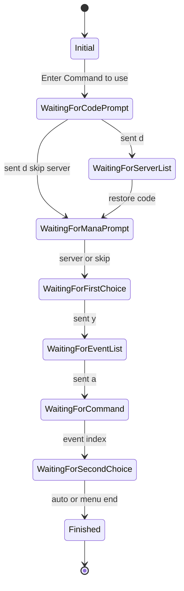

# Architecture Document

Deep technical reference for the Evertext Automation Framework.

## System Components

### 1. Discord Orchestrator (`src/bot.js`, `src/manager.js`)

- Accepts slash commands via Discord.js
- Maintains permission checks (admin role + Discord Administrator)
- Delegates execution to the manager queue
- Bridges application logs to Discord embeds via `sendLog`

### 2. Browser Controller (`src/browser-controller.js`)

- Launches a shared Chromium instance (optional reuse across sessions)
- Creates isolated incognito contexts per session
- Injects `session` cookie and navigates to the target URL
- Clicks DOM **Start** / **Stop** to bootstrap and tear down the server-side terminal

### 3. WebSocket Client (`src/websocket-client.js`)

- Connects to `wss://…/socket.io/?EIO=4&transport=websocket`
- Completes Engine.IO handshake and namespace upgrade
- Emits `output` (terminal text), `user_count`, handles `idle_timeout` and `connection_failed`
- Sends commands via `42["input",{"input":"..."}]` packets

### 4. Rust Decision Engine (`evertext_brain/src/main.rs`)

- Spawned as child process by `src/brain.js`
- Maintains `BotSession` state and rolling terminal history
- Pattern-matches terminal prompts and returns `OutputCommand` JSON

---

## Request Lifecycle (Discord → Rust Action)

```
User: /force_run_all
  │
  ▼
bot.js ──► manager.runBatch() / processQueueFull()
  │
  ▼
manager ──► getAccountDecrypted() ──► runner.runSession(account, sharedBrowser)
  │
  ├─► brain.start()          send { type: "init" }  ──► { action: "ready" }
  ├─► browser.launch()       cookie inject + navigate
  ├─► ws.connect()           Engine.IO handshake
  ├─► browser.clickStart()   DOM bootstrap
  │
  ▼
[loop]
  ws "output" ──► terminalBuffer
  runner ──► brain.processTerminalOutput(buffer, account)
  brain ──► Rust stdin JSON ──► stdout { action, payload?, ... }
  runner ──► ws.sendCommand(payload) | clickStop | defer | restart
  │
  ▼
{ action: "close_terminal" } ──► manager marks session DONE
```

---

## IPC Message Format

### Input (`InputMessage`)

```json
{ "type": "init" }
```

```json
{
  "type": "terminal_output",
  "content": "Enter Restore code",
  "account": {
    "code": "…",
    "targetServer": "E-15",
    "server_toggle": true
  }
}
```

Note: Node sends `name` in account context; Rust deserializes `code`, `targetServer`, `server_toggle`.

### Output (`OutputCommand`)

```json
{ "action": "ready", "message": "Rust brain initialized" }
```

```json
{ "action": "send_text", "payload": "y", "context": "mana_confirm" }
```

```json
{ "action": "close_terminal", "reason": "Process ended" }
```

```json
{ "action": "restart_terminal", "reason": "Invalid command recovery" }
```

```json
{ "action": "defer_account", "reason": "Either Zigza error or Incorrect Restore Code" }
```

```json
{ "action": "wait" }
```

---

## State Machine Diagram



---

## Concurrency Model

- **Queue:** Sequential — one session runs at a time via `processQueueFull`
- **Lock:** `AsyncLock` prevents overlapping `processQueueFull` invocations
- **Browser:** Single shared `BrowserController` reused across sessions in a batch; incognito context per session
- **Brain:** One Rust child process per `runSession`; stopped after each session
- **WebSocket:** One client per session; reconnected on restart path

Simultaneous multi-session execution is intentionally **not** supported to avoid terminal slot contention and rate limits.

---

## Known Limitations

- Sequential queue only — no parallel sessions
- Target URL and WebSocket endpoint are configured with `GAME_URL` and `WS_BASE_URL`
- Rust brain path must exist at `evertext_brain/target/release/evertext_brain[.exe]`
- Discord log delivery is best-effort (3 retries)
- The Rust state machine currently models one authorized terminal workflow

## Future Improvements

- Per-operator session filtering in Discord commands
- Adapter-style prompt/action configuration for additional terminal workflows
- Metrics export (Prometheus) from health server
- Parallel sessions with terminal slot coordination
