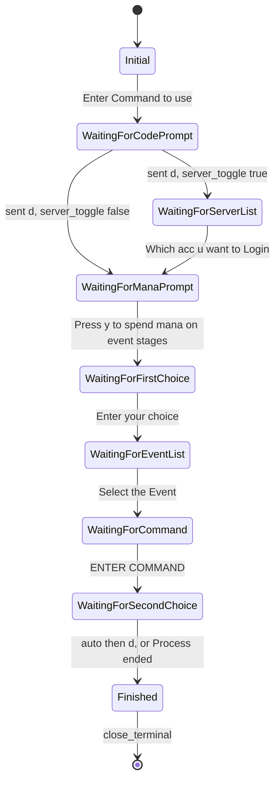

# Evertext Automation Framework

### Hybrid Browser Automation · Real-time WebSocket Orchestration · Cross-language IPC


The Evertext Automation Framework is a multi-process automation system that combines a Puppeteer-based browser controller, a raw Engine.IO WebSocket client, and a Rust decision engine communicating over JSON stdin/stdout IPC, all orchestrated through a Discord.js v14 slash-command interface. The core engineering problem it addresses is the tradeoff between session longevity (24-hour-plus cookies injected and maintained via Chromium) and real-time I/O performance (direct WebSocket terminal streams after DOM bootstrap). The stack is Node.js (ES modules) for orchestration, Rust for deterministic state-machine parsing, discord.js v14 for the operator UI, lowdb with CryptoJS for encrypted credential storage, Puppeteer for browser lifecycle, and the `ws` package for protocol-level Socket.IO transport. Deployment targets include a multi-stage Docker image (Rust compile stage plus Chromium runtime stage), Zeabur cloud via `zeabur.json`, PM2 on Linux, and a standalone Windows executable produced by caxa. The architecture is intentionally sequential—one remote-service session at a time—to respect terminal slot limits on the target platform.

📹 **[Watch the Evertest Automation Framework Guide](Evertest Automation Framework Guide.mp4)**

---

## Technical Highlights

1. **Cross-language IPC (`src/brain.js` + `evertext_brain/src/main.rs`)**  
   The Node.js host and the Rust binary exchange one JSON object per newline on stdin/stdout. Inbound shapes are `{ "type": "init" }` and `{ "type": "terminal_output", "content": "...", "account": { ... } }` where account carries decrypted credentials and server-selection flags. Outbound actions are `ready`, `send_text`, `close_terminal`, `restart_terminal`, `defer_account`, and `wait`. The wrapper spawns the release binary, queues response handlers, and enforces a 30-second IPC timeout (`BRAIN_RESPONSE_TIMEOUT_MS`).

2. **Hybrid session architecture (`src/browser-controller.js` + `src/websocket-client.js`)**  
   Puppeteer launches Chromium (or reuses a shared instance), creates an incognito context, injects the `session` cookie, and navigates to `https://evertext.sytes.net` so authentication persists across long runs. After the DOM **Start** button bootstraps the server-side terminal, all real-time I/O moves to a custom WebSocket client that implements Engine.IO v4 manually: packet `0` (open/handshake with `sid` and `pingInterval`), client sends `40` (namespace connect), events arrive as `42[...]`, server ping `2` is answered with pong `3`, and commands are emitted as `42["input",{"input":"..."}]`.

3. **Rust state machine (`evertext_brain/src/main.rs`)**  
   The `BotState` enum drives nine active phases (`Initial` through `Finished`) with compile-time exhaustiveness on transitions. A rolling terminal history buffer appends each chunk, caps growth at 15,000 characters, and trims to 10,000 (`BRAIN_HISTORY_BUFFER_SIZE` in `src/constants.js`) while preserving UTF-8 boundaries. Rust runs in an isolated child process so heavy string matching never blocks the Node.js event loop.

4. **AES-encrypted credential storage (`src/db.js`)**  
   Restore codes are encrypted with CryptoJS AES using `ENCRYPTION_KEY` before any write to `db.json`. If the key is missing or still the placeholder default, a 32-byte hex key is generated on first run and appended to `.env`. Persistence uses `JSONFilePreset` with atomic writes (temp file + rename) and a 5-second in-memory cache to reduce disk reads.

5. **Typed error hierarchy (`src/errors.js`)**  
   Eight error classes provide structured recovery: `CodedError` (base with `.code`), `SessionExpiredError` (`LOGIN_REQUIRED`), `BrainCommunicationError`, `ZigzaError` (`ZIGZA_DEFER`), `ServerFullError`, `ValidationError`, `IdleTimeoutError` (`IDLE_TIMEOUT`), and `ConnectionFailedError` (`CONNECTION_FAILED`). The helper `isErrorCode()` supports both `.code` properties and legacy message matching in `src/runner.js` and `src/manager.js`.

6. **Structured logging (`src/logger.js`)**  
   Four severities—ERROR, WARN, INFO, DEBUG—are filtered by the `LOG_LEVEL` environment variable. Output format is `[YYYY-MM-DD HH:mm:ss] [LEVEL] [MODULE] message`. Application code under `src/` uses `createLogger(module)` exclusively; the underlying `console.*` calls exist only inside the logger sink implementation.

7. **Session queue with defer/retry logic (`src/manager.js`)**  
   An `AsyncLock` (`src/async-lock.js`) prevents overlapping `processQueueFull` runs. Rate-limit deferrals set a timestamp in `deferredAccounts` and skip the session for `ZIGZA_DEFER_DELAY_MS` (600,000 ms / 10 minutes), with per-account attempt and cycle counters capped at `MAX_RETRY_ATTEMPTS` and `MAX_DEFER_CYCLES` (both 3). A `node-cron` job fires every minute in the `Asia/Kolkata` timezone to reset all account statuses at 00:00 IST. The kill-switch sets `shouldStop` via `forceStop()` so the active session finishes but no new sessions start.

8. **HTTP health-check server (`src/health-server.js`)**  
   A minimal Node `http` server (no Express) exposes `/health` and `/ping`, returning JSON `{ status, uptime, lastActivitySeconds, memoryMB }` with HTTP 200 when healthy or 503 when degraded. `updateActivity()` is called before each session; `setHealthy()` allows external degradation signaling for orchestrators such as Zeabur and Docker.

9. **Interactive first-run setup wizard (`setup.js`)**  
   On launch, if `.env` is missing or lacks `DISCORD_TOKEN=`, a readline wizard prompts for the Discord token (required), optional encryption key, and optional log channel ID, then writes `.env` before the main bootstrap continues. Subsequent launches detect an existing token and skip the wizard.

10. **Log rotation (`src/log-rotator.js`)**  
    On scheduler startup, `rotateLogs()` scans the project root for `.log`, `.tmp`, and `.png` files older than `LOG_ROTATION_MAX_AGE_MS` (86,400,000 ms / 24 hours) and deletes them.

11. **Multi-stage Docker build (`Dockerfile`)**  
    Stage `builder` uses `node:20-slim`, installs the Rust toolchain, and runs `cargo build --release` inside the container. Stage `runner` installs system Chromium, sets `PUPPETEER_EXECUTABLE_PATH=/usr/bin/chromium` and `PUPPETEER_SKIP_CHROMIUM_DOWNLOAD=true`, copies production `node_modules`, copies only the compiled brain binary from the builder stage, and starts with `CMD ["node", "index.js"]` on port 3000.

12. **Discord slash command interface (`src/bot.js`)**  
    Fifteen slash commands cover account lifecycle, queue control, scheduling, and operator configuration. Permission checks combine a configurable Discord admin role (`/set_admin_role`) with the Discord `Administrator` permission flag. Long-running operations reply immediately and use `followUp` for completion. `sendLog` delivers color-coded embeds to the configured log channel with three retry attempts.

13. **Windows executable (`package.json` build script + `start_bot.bat`)**  
    `npm run build` invokes caxa to bundle `node.exe`, the application source, and dependencies into a single `bot.exe`. Operators run `start_bot.bat` (which `cd`s to the script directory and launches `bot.exe`) without installing Node.js locally. The Rust brain must be built separately (`cargo build --release`) so `evertext_brain/target/release/evertext_brain.exe` exists at the path `src/brain.js` resolves.

---

## Architecture Overview

### System Diagram

```
┌─────────────────────────────────────────────────────────────────────┐
│                       Discord Slash Commands                        │
│  /add_account  /force_run  /force_run_all  /force_stop_all         │
│  /set_schedule  /set_cookies  /set_admin_role  /toggle_ping  ...   │
└──────────────────────────────┬──────────────────────────────────────┘
                               │
                               ▼
┌─────────────────────────────────────────────────────────────────────┐
│  bot.js — Discord.js v14 gateway                                   │
│  Permission checks (admin role + Discord.Administrator flag)       │
│  sendLog embeds → Discord log channel                              │
└──────────────────────────────┬──────────────────────────────────────┘
                               │
                               ▼
┌─────────────────────────────────────────────────────────────────────┐
│  manager.js — Queue Orchestrator                                   │
│  AsyncLock · Sequential queue · Defer map · Kill-switch            │
│  node-cron daily reset (00:00 IST) · Log rotation                 │
└──────────────────────────────┬──────────────────────────────────────┘
                               │  runSession(account, sharedBrowser)
                               ▼
┌─────────────────────────────────────────────────────────────────────┐
│  runner.js — Per-session Orchestration                             │
│  ┌─────────────────┐  ┌──────────────────┐  ┌──────────────────┐  │
│  │ BrowserController│  │ WebSocketClient  │  │ Brain (IPC)      │  │
│  │ Puppeteer/Chrom  │  │ Engine.IO ws     │  │ Rust child proc  │  │
│  │ Cookie inject    │  │ 42["input",...]  │  │ stdin/stdout JSON│  │
│  │ Click Start/Stop │  │ terminal output  │  │ state machine    │  │
│  └─────────────────┘  └──────────────────┘  └──────────────────┘  │
└─────────────────────────────────────────────────────────────────────┘
                               │
                               ▼
┌─────────────────────────────────────────────────────────────────────┐
│  db.js — lowdb + CryptoJS AES                                      │
│  db.json: accounts, cookies, schedule, settings                    │
└─────────────────────────────────────────────────────────────────────┘
                               │
                     ┌─────────┴──────────┐
                     ▼                    ▼
┌──────────────────────────┐  ┌──────────────────────────┐
│  health-server.js        │  │  log-rotator.js          │
│  /health  /ping          │  │  24h .log/.tmp/.png      │
│  uptime · mem · activity │  │  cleanup on startup      │
└──────────────────────────┘  └──────────────────────────┘
```

### Component Breakdown

| Component | File | Language | Responsibility |
|-----------|------|----------|----------------|
| Application entry | `index.js` | JavaScript | Runs `setup.js`, kills orphaned headless Chrome, starts health server on `PORT`, calls `startScheduler()` and `startBot()`, registers SIGTERM/SIGINT graceful shutdown via `forceStop()` and `client.destroy()` |
| First-run wizard | `setup.js` | JavaScript | Interactive readline prompts for `DISCORD_TOKEN`, optional `ENCRYPTION_KEY` and `LOG_CHANNEL_ID`; writes `.env` when missing |
| Discord gateway | `src/bot.js` | JavaScript | Registers 15 slash commands (guild or global via `GUILD_ID`), enforces admin role checks, dispatches handlers, exports `sendLog` with embed colors and retry logic |
| Queue orchestrator | `src/manager.js` | JavaScript | `processQueueFull` sequential loop, defer/retry maps, shared browser reuse, `forceStop` kill-switch, daily IST cron reset, exports `runBatch`, `executeSession`, fountain helpers |
| Session runner | `src/runner.js` | JavaScript | `runSession` wires brain, browser, WebSocket; connection backoff; terminal buffer loop; executes brain actions (`send_text`, `close_terminal`, `restart_terminal`, `defer_account`, `wait`) |
| Browser controller | `src/browser-controller.js` | JavaScript | Puppeteer launch/reuse, incognito context, cookie injection, `clickStart`/`clickStop` with selector waits, `isLoginRequired` detection |
| WebSocket client | `src/websocket-client.js` | JavaScript | Engine.IO handshake to `WS_BASE_URL`, ping/pong keepalive, parses `output`/`user_count_update`/`idle_timeout`/`connection_failed` events, `sendCommand` with flood delay |
| Brain IPC wrapper | `src/brain.js` | JavaScript | Spawns `evertext_brain` release binary, stdin JSON writes, stdout line parsing, `sendAndWait` with timeout, `processTerminalOutput` validation |
| Rust decision engine | `evertext_brain/src/main.rs` | Rust | `BotState` machine, terminal pattern matching via `MSG_*` constants, rolling history, emits `OutputCommand` JSON lines |
| Encrypted store | `src/db.js` | JavaScript | lowdb `JSONFilePreset`, AES encrypt/decrypt, atomic write via temp+rename, account CRUD, schedule/cookies/admin role/log channel settings |
| Structured logger | `src/logger.js` | JavaScript | `createLogger(module)` with `LOG_LEVEL` gating and timestamped `[LEVEL] [MODULE]` format |
| Central constants | `src/constants.js` | JavaScript | Timing, IPC action enums, terminal string patterns, error codes, URLs |
| Legacy config object | `src/config.js` | JavaScript | Re-exports `constants.js` values as `config` for `runner.js` and `manager.js` |
| Typed errors | `src/errors.js` | JavaScript | Eight error classes plus `isErrorCode()` helper |
| JSDoc types | `src/types.js` | JavaScript | Shared typedefs for `Account`, `BrainMessage`, `BrainResponse`, `SessionResult`, etc. |
| Async mutex | `src/async-lock.js` | JavaScript | FIFO lock preventing concurrent `processQueueFull` invocations |
| Health HTTP server | `src/health-server.js` | JavaScript | `/health` and `/ping` JSON liveness on Node `http` module |
| Log maintenance | `src/log-rotator.js` | JavaScript | Deletes stale `.log`/`.tmp`/`.png` files older than 24 hours |
| Package manifest | `package.json` | JSON | Dependencies, `npm start`, caxa `npm run build` for `bot.exe` |
| Container image | `Dockerfile` | Docker | Multi-stage `builder` (Rust compile) + `runner` (Chromium + Node app) |
| Cloud deploy config | `zeabur.json` | JSON | Points Zeabur at `Dockerfile` |
| Zeabur notes | `ZEABUR_DEPLOYMENT.md` | Markdown | Resource expectations and env var checklist for cloud deploy |
| Env template | `.env.example` | Config | Documented variables for Discord, logging, encryption, health port |
| Windows launcher | `start_bot.bat` | Batch | Changes to script directory and runs `bot.exe` with pause on exit |
| Architecture reference | `ARCHITECTURE.md` | Markdown | Extended IPC, lifecycle, concurrency, and limitation notes |

---

## Request Lifecycle

When an operator invokes `/force_run_all`, the following path executes end to end.

The Discord interaction reaches `bot.js`, which verifies the caller holds either the configured admin role or the Discord `Administrator` permission, then replies with a queue-start message and calls `runBatch(accounts)`, which delegates to `processQueueFull()` in `manager.js`.

`processQueueFull` acquires the `AsyncLock`. If another queue is already marked `isRunning`, it logs and returns immediately. Otherwise it sets `isRunning`, clears `shouldStop`, loads all accounts from `db.js`, and filters those with status `idle` or `pending`. For each account in the loop, it checks the kill-switch flag first—if `forceStop()` was called, it logs, sends a Discord error embed, and breaks without starting new sessions.

Accounts in `deferredAccounts` whose elapsed time is still within `ZIGZA_DEFER_DELAY_MS` (10 minutes) are skipped with a log line showing remaining minutes. After the window expires, the defer entry is removed and processing continues.

For each active account, `getAccountDecrypted()` AES-decrypts the stored restore code. `updateActivity()` refreshes the health-server timestamp. `runSession(account, sharedBrowser)` in `runner.js` then:

1. Starts `RustBrain` and sends `{ "type": "init" }`; waits for `{ "action": "ready" }`.
2. Launches or reuses `BrowserController`, injects the global session cookie from `db.js`, navigates to the target URL, and checks for login-page redirect (`SessionExpiredError` if cookies are invalid).
3. Connects `EvertextWebSocketClient` with exponential backoff on `CONNECTION_FAILED` until connected or `CONNECT_TIMEOUT_MS` elapses.
4. Waits for a terminal slot if `user_count` reports capacity full.
5. Calls `browser.clickStart()` to bootstrap the server-side terminal stream.

The event loop then runs until `MAX_SESSION_TIME_MS` (20 minutes) or an error:

- WebSocket `output` events append to `terminalBuffer`.
- On new text, `runner` strips HTML, optionally injects history context for server/event selection prompts, and calls `brain.processTerminalOutput(cleanText, account)`.
- Rust responds on stdout with an action JSON line.
- `runner` executes: `send_text` → `ws.sendCommand(payload)`; `close_terminal` → `clickStop`, close WS, stop brain, return success; `restart_terminal` → stop, re-init brain, reconnect WS; `defer_account` → teardown and return `{ defer: true }`; `wait` → sleep `BRAIN_WAIT_LOOP_MS` and continue.

On `{ action: "close_terminal" }`, the manager marks the account `done`, retains the shared browser reference, waits `INTER_ACCOUNT_DELAY_MS` (10 seconds), calls `clickStop` on the shared browser, and waits `BROWSER_PROCESS_CLEANUP_MS` (5 seconds) before the next account.

On defer, the manager increments attempt/cycle counters, may re-append the account to the queue tail, and sets a defer timestamp for the 10-minute skip window.

On failure, the catch block retries up to `MAX_RETRY_ATTEMPTS` (3). `IdleTimeoutError` and `SessionExpiredError` retry without closing the shared browser; other errors close the incognito context and null the shared browser before retrying.

When the queue completes, the shared browser context is closed, `isRunning` is cleared, and `sendLog` posts a completion embed.

### Annotated flow

```
/force_run_all
  │
  ▼  bot.js validates permission, calls manager.runBatch()
  │
  ▼  manager: AsyncLock acquired; accounts fetched from db.js;
  │   deferred accounts skipped if within 10-min window
  │
  ▼  manager: getAccountDecrypted() → AES-decrypt restore code
  │
  ▼  runner.runSession(account, sharedBrowser)
  │    ├── brain.start()      →  { type:"init" }  →  { action:"ready" }
  │    ├── browser.launch()   →  incognito context + cookie inject + navigate
  │    ├── ws.connect()       →  Engine.IO handshake
  │    └── browser.clickStart() → DOM bootstrap → terminal stream begins
  │
  ▼  [event loop]
  │    ws "output" event → terminalBuffer accumulated
  │    runner → brain.processTerminalOutput(buffer, account)
  │    brain → Rust stdin JSON → stdout { action, payload }
  │    runner → ws.sendCommand(payload) | clickStop | defer | restart
  │
  ▼  { action:"close_terminal" } → runner tears down WS + brain process
  │
  ▼  manager marks account DONE; INTER_ACCOUNT_DELAY_MS pause; next account
  │
  ▼  Queue empty → lock released; sendLog summary embed to Discord
```

---

## IPC Protocol Specification

All inter-process communication uses **one JSON object per line** on the Rust child process stdin (parent → child) and stdout (child → parent). No binary framing or length prefixes are used.

### Node → Rust (InputMessage)

**Initialize** — sent once when `RustBrain.start()` spawns the process:

```json
{ "type": "init" }
```

**Terminal output** — sent on each brain loop iteration with the latest (or contextual) terminal text:

```json
{
  "type": "terminal_output",
  "content": "raw terminal text...",
  "account": {
    "name": "display-label",
    "code": "decrypted-restore-code",
    "targetServer": "E-15",
    "server_toggle": true
  }
}
```

Node includes `name` in the account object for logging context. Rust deserializes `code`, `targetServer`, and `server_toggle` (serde field `server_toggle` on `AccountInfo`).

### Rust → Node (OutputCommand)

| action | Fields | Trigger condition | Runner response |
|--------|--------|-------------------|-----------------|
| `ready` | `message` | Brain process started and parsed `init` | Resolves `brain.start()` promise; session continues |
| `send_text` | `payload`, `context?` | State machine determined the next terminal input (e.g. restore code, server index, `y`, `a`, event index, `auto`, `d`) | `ws.sendCommand(payload)`; optional Discord embed when `context` is `server_selection` or `event_selection` |
| `close_terminal` | `reason` | Session finished (`Finished` state + process ended, or clean completion) | `browser.clickStop()`, close WebSocket, `brain.stop()`, return `{ success: true }` |
| `restart_terminal` | `reason` | Invalid command detected (`MSG_INVALID_COMMAND` + `MSG_EXITING_NOW`) or server full (`MSG_SERVER_FULL`) | Stop terminal, close WS, send `{ type: "init" }` to brain, `clickStart`, new WebSocket, reset buffer |
| `defer_account` | `reason` | Rate-limit / bad restore pattern (`MSG_ZIGZA_ERROR`) or runner-side terminal-full defer | Teardown WS and brain; return `{ success: false, defer: true, error: ZigzaError }` |
| `wait` | — | Terminal output does not yet match the pattern for the current `BotState` | Sleep `BRAIN_WAIT_LOOP_MS` (1,500 ms) and continue polling loop |

---

## State Machine

### State table

| State | Outbound command | Terminal pattern waited for | Next state |
|-------|------------------|----------------------------|------------|
| `Initial` | — | `Enter Command to use` | `WaitingForCodePrompt` |
| `WaitingForCodePrompt` | `d` | `Enter Restore code` | `WaitingForServerList` if `server_toggle` is true, else `WaitingForManaPrompt` |
| `WaitingForServerList` | restore code (already sent); then server index | `Which acc u want to Login` (or early mana prompt if single-server) | `WaitingForManaPrompt` |
| `WaitingForManaPrompt` | server index or bypass | `Press y to spend mana on event stages` | `WaitingForFirstChoice` |
| `WaitingForFirstChoice` | `y` | `Enter your choice [a / b / c / d]` | `WaitingForEventList` |
| `WaitingForEventList` | `a` | `Select the Event [` | `WaitingForCommand` |
| `WaitingForCommand` | event index (soonest-expiring) | `ENTER COMMAND:` | `WaitingForSecondChoice` |
| `WaitingForSecondChoice` | `auto`, then `d` on second menu | Second `Enter your choice` or `Process ended with return code 0` | `Finished` |
| `Finished` | — (emits `close_terminal` when process ends) | Parent teardown | — |

Global priority checks in every state: invalid command → `restart_terminal`; rate-limit string → `defer_account`; server full string → `restart_terminal`.

### Mermaid diagram



---

## Discord Command Reference

| Command | Admin-only | Options | Description |
|---------|------------|---------|-------------|
| `/add_account` | Yes | `name` (string), `code` (string), `server_toggle` (boolean), `server` (string, optional) | Add or update a session with AES-encrypted restore code; `server` required when `server_toggle` is true |
| `/list_accounts` | Yes | — | List all configured sessions with status embeds (paginated if more than 10) |
| `/list_my_accounts` | No | — | Placeholder — replies that per-user filtering is not yet implemented |
| `/toggle_ping` | No | — | Placeholder — ping notification toggle not yet implemented |
| `/force_run` | Yes | `name` (string, optional) | Run one session by name, or all sessions if `name` is `all`; uses `executeSession` or `runBatch` |
| `/force_run_all` | Yes | — | Queue every account in the database via `runBatch` |
| `/force_run_again_all` | Yes | — | Reset all statuses to pending and start the queue immediately |
| `/force_run_error_all_again` | Yes | — | Reset non-done accounts to pending and start the queue |
| `/force_stop_all` | Yes | — | Activate kill-switch (`forceStop`) — current session drains, queue stops |
| `/remove_account` | Yes | `name` (string) | Remove a session by display name |
| `/set_schedule` | Yes | `start_hour` (0–23), `end_hour` (0–23) | Persist active hours as `HH:00` strings in `db.json` settings |
| `/set_cookies` | Yes | `cookies` (string) | Update global session cookie used by browser and WebSocket auth |
| `/set_admin_role` | Yes (Discord Administrator only) | `role` (role) | Store role ID allowed to run sensitive commands |
| `/set_log_channel` | Yes (Discord Administrator only) | `channel` (channel) | Persist Discord channel ID for `sendLog` embeds |
| `/mute_bot` | Yes | — | Acknowledge mute request (status message only) |
| `/unmute_bot` | Yes | — | Acknowledge unmute request (status message only) |

Admin-only commands require the configured admin role **or** the Discord `Administrator` permission, except `/set_admin_role` and `/set_log_channel`, which require Discord `Administrator` specifically.

---

## Error Handling

| Error class | Code constant | Trigger | Recovery action |
|-------------|---------------|---------|-----------------|
| `CodedError` | (caller-defined) | Base class for machine-readable `.code` | Handled by subclasses and `isErrorCode()` |
| `SessionExpiredError` | `LOGIN_REQUIRED` | `browser.isLoginRequired()` detects OAuth login link after cookie inject | Manager retries up to 3 times **without** closing shared browser; operator must run `/set_cookies` with a valid session |
| `IdleTimeoutError` | `IDLE_TIMEOUT` | No new terminal output within `IDLE_TIMEOUT_MS` (90 s), or WebSocket `idle_timeout` event | Manager retries without browser restart |
| `ConnectionFailedError` | `CONNECTION_FAILED` | WebSocket `connection_failed` event or terminal-at-capacity during connect loop | Runner exponential backoff (5 s → 60 s cap) inside connect loop; may eventually throw `ServerFullError` |
| `ServerFullError` | — | Connect loop exhausts `CONNECT_TIMEOUT_MS` (10 min) without a slot | Session fails; may return defer path if slot wait times out |
| `ZigzaError` | `ZIGZA_DEFER` | Rust `defer_account` or runner terminal-full defer | Manager sets 10-minute defer timestamp, re-queues account tail, max 3 attempts × 3 defer cycles then `error` status |
| `BrainCommunicationError` | — | Brain process fails to start, IPC timeout (`BRAIN_RESPONSE_TIMEOUT_MS` 30 s), or process exit while handlers pending | Session fails; may retry via manager catch with browser restart |
| `ValidationError` | — | Invalid slash command input, missing IPC fields, invalid DB status enum | Ephemeral Discord error reply; no queue side effects |
| Kill-switch (`shouldStop`) | — | `/force_stop_all` → `forceStop()` | Current `runSession` completes teardown; loop breaks before next account; `sendLog` error embed |

---

## Configuration Reference

### Environment variables

| Variable | Required | Default | Source | Description |
|----------|----------|---------|--------|-------------|
| `DISCORD_TOKEN` | Yes | — | `.env` / setup wizard | Discord bot token from Developer Portal |
| `GUILD_ID` | No | placeholder | `.env` | Guild ID for instant slash-command registration; omit or use placeholder for global registration |
| `LOG_LEVEL` | No | `INFO` | `.env` | Console verbosity: `DEBUG`, `INFO`, `WARN`, `ERROR` |
| `ENCRYPTION_KEY` | Recommended | auto-generated | `.env` / `db.js` on first run | AES key for restore codes in `db.json` |
| `LOG_CHANNEL_ID` | No | — | `.env` or `/set_log_channel` | Fallback Discord channel for `sendLog` embeds |
| `PORT` | No | `3000` | `.env` / `index.js` | HTTP port for `/health` and `/ping` |

### Timing and capacity constants

Operators tuning behavior should edit [`src/constants.js`](src/constants.js) (re-exported through [`src/config.js`](src/config.js)):

| Constant | Value | Meaning |
|----------|-------|---------|
| `IDLE_TIMEOUT_MS` | 90,000 | Terminal idle before `IdleTimeoutError` |
| `MAX_SESSION_TIME_MS` | 1,200,000 | Maximum single-session duration (20 min) |
| `ZIGZA_DEFER_DELAY_MS` | 600,000 | Defer skip window (10 min) |
| `INTER_ACCOUNT_DELAY_MS` | 10,000 | Pause between queued sessions |
| `BRAIN_HISTORY_BUFFER_SIZE` | 10,000 | Rust history trim target |
| `MAX_RETRY_ATTEMPTS` | 3 | Per-account error retries |
| `MAX_DEFER_CYCLES` | 3 | Maximum defer cycles per account |

---

## Installation & Setup

### Prerequisites

- **Node.js** v18 or newer (ES modules)
- **Rust / Cargo** (to compile `evertext_brain` for local development)
- **Discord bot token** with slash-command scope

Docker deployments do not require Node.js or Rust on the host machine.

### Local development

```bash
git clone https://github.com/Parth-Manav/Evertext-self-bot.git
cd Evertext-self-bot
npm install

cd evertext_brain
cargo build --release
cd ..

cp .env.example .env
# Edit .env or rely on first-run wizard

npm start
```

**First-run wizard:** If `.env` does not contain `DISCORD_TOKEN=`, `setup.js` runs before bootstrap. It prompts for:

1. `DISCORD_TOKEN` (required — exits if empty)
2. `ENCRYPTION_KEY` (optional — warns if skipped)
3. `LOG_CHANNEL_ID` (optional)

It writes `.env` and the main process continues into Chrome cleanup, health server startup, scheduler, and Discord login.

### Windows standalone (no local Node.js or Rust)

1. Obtain `bot.exe` from a release or run `npm run build` after compiling the brain.
2. Place `.env` in the same directory as `bot.exe`.
3. Ensure `evertext_brain/target/release/evertext_brain.exe` exists relative to the bundled app layout (build the brain before caxa, or copy the binary into the expected path).
4. Double-click `start_bot.bat` or run:

```bat
bot.exe
```

### Build the Windows executable yourself

```bash
cd evertext_brain
cargo build --release
cd ..
npm run build
```

The `build` script runs caxa to produce `bot.exe` containing `node.exe`, application source, and production dependencies. The Rust binary is **not** embedded by caxa automatically—it must exist at `evertext_brain/target/release/evertext_brain.exe` where `src/brain.js` resolves it at runtime.

---

## Deployment

### Docker

Full [`Dockerfile`](Dockerfile):

```dockerfile
# --- Stage 1: Build Rust Brain ---
FROM node:20-slim AS builder

# Install Rust toolchain and build requirements
RUN apt-get update && apt-get install -y \
    curl \
    build-essential \
    && curl --proto '=https' --tlsv1.2 -sSf https://sh.rustup.rs | sh -s -- -y \
    && apt-get clean \
    && rm -rf /var/lib/apt/lists/*

ENV PATH="/root/.cargo/bin:${PATH}"

WORKDIR /app

# Copy brain source
COPY evertext_brain ./evertext_brain

# Build release binary
WORKDIR /app/evertext_brain
RUN cargo build --release

# --- Stage 2: Runtime Environment ---
FROM node:20-slim AS runner

WORKDIR /app

# Install Chromium dependencies for Puppeteer (Runtime only)
RUN apt-get update && apt-get install -y \
    chromium \
    chromium-sandbox \
    && rm -rf /var/lib/apt/lists/*

# Set Puppeteer to use system Chromium
ENV PUPPETEER_SKIP_CHROMIUM_DOWNLOAD=true
ENV PUPPETEER_EXECUTABLE_PATH=/usr/bin/chromium

# Copy package files and install PROD dependencies
COPY package*.json ./
RUN npm install --production --ignore-scripts

# Copy React Brain Binary from builder stage
COPY --from=builder /app/evertext_brain/target/release/evertext_brain ./evertext_brain/target/release/

# Copy application source code
COPY . .

EXPOSE 3000

CMD ["node", "index.js"]
```

Build and run:

```bash
docker build -t evertext-bot .
docker run -d --env-file .env -p 3000:3000 evertext-bot
```

- **Stage `builder`:** Compiles the Rust brain inside the image—no local Rust toolchain required on the host.
- **Stage `runner`:** Installs system Chromium, sets `PUPPETEER_EXECUTABLE_PATH` to avoid downloading a second browser, copies only the release binary from `builder`, and starts Node on port 3000.

### Zeabur cloud

[`zeabur.json`](zeabur.json) points the platform at the root `Dockerfile`.

1. Push the repository to GitHub.
2. Connect the repo in Zeabur and deploy.
3. Set environment variables: `DISCORD_TOKEN`, `ENCRYPTION_KEY` (and optionally `LOG_CHANNEL_ID`, `GUILD_ID`, `LOG_LEVEL`, `PORT`).
4. Zeabur uses the `/health` endpoint on `PORT` (default 3000) for liveness probes.

See [`ZEABUR_DEPLOYMENT.md`](ZEABUR_DEPLOYMENT.md) for resource expectations (approximately 50–80 MB idle, 150–250 MB during browser automation).

### PM2 (Linux process manager)

```bash
npm install -g pm2
pm2 start index.js --name "evertext-bot"
pm2 save
pm2 startup
```

---

## Design Decisions & Tradeoffs

**Hybrid Puppeteer plus WebSocket.** A browser-only approach cannot sustain 24-hour cookie sessions efficiently while polling DOM output for every terminal line. A WebSocket-only approach cannot inject or refresh HTTP session cookies or click the DOM **Start** control that allocates a server-side terminal slot. The hybrid model uses Puppeteer solely for authentication bootstrap and Start/Stop UI actions, then hands off all streaming I/O to a direct WebSocket connection for millisecond-level command injection.

**Rust for the decision engine.** Terminal output is unstructured, multi-page text with branching prompts. Implementing the state machine in JavaScript would work functionally but couples heavy string scanning to the same event loop that services Discord and WebSocket I/O. Rust provides enum exhaustiveness, constant-time pattern matching on large buffers, and process isolation: the child can block on stdin/stdout parsing without stalling Node.js timers.

**`ws` instead of the full Socket.IO client.** The remote service speaks Socket.IO over Engine.IO v4. Rather than depending on the full `socket.io-client` stack, the project implements the minimal packet sequence (`0` open, `40` namespace, `42` events, `2`/`3` ping/pong) on top of `ws`. This reduces dependency surface while remaining wire-compatible with the server's transport.

**lowdb instead of SQLite or Postgres.** The deployment model is a single operator running one bot instance with tens of sessions, not a multi-tenant service. A JSON file with atomic rename writes and AES encryption on sensitive fields avoids schema migrations, connection pools, and external database provisioning. The security requirement is confidentiality at rest for restore codes, not relational querying at scale.

**Single shared browser instance.** Launching Chromium per session costs several hundred megabytes and several seconds. The manager holds one `BrowserController` for an entire batch, creating a fresh incognito context per session so cookies and cache do not leak between sessions, while amortizing process startup across the queue. Sequential execution further ensures only one terminal slot is contested at a time.

---

## Known Limitations & Future Work

### Known limitations

- Sequential queue only—no parallel sessions; enforced by `isRunning` and single-threaded `processQueueFull` loop.
- Target URL (`GAME_URL`) and WebSocket endpoint (`WS_BASE_URL`) are hardcoded in `src/constants.js`.
- Rust brain binary must exist at `evertext_brain/target/release/evertext_brain` (or `.exe` on Windows) at the path resolved by `src/brain.js`.
- Discord log delivery is best-effort with three embed send retries.
- Legacy `ManaRefillFlow` state exists in Rust but is unreachable in the active machine.
- `/list_my_accounts` and `/toggle_ping` are stub commands.
- `express` is listed in `package.json` but is not used by the health server (Node `http` only).

### Future improvements

- Per-operator session filtering in Discord commands.
- Configurable target URL via environment variable instead of hardcoded constants.
- Prometheus metrics export from `health-server.js`.
- Parallel session support with coordinated terminal slot allocation.
- Deeper Zeabur resource scheduling integration beyond static health checks.

---

## Contributing

### Development environment

- Node.js v18+ with ES modules
- Rust / Cargo for compiling `evertext_brain`

```bash
npm install
cd evertext_brain && cargo build --release && cd ..
cp .env.example .env   # set DISCORD_TOKEN
npm start
```

### Test the Rust brain standalone

```bash
cd evertext_brain
cargo build --release
```

Linux/macOS:

```bash
echo '{"type":"init"}' | ./target/release/evertext_brain
```

Windows PowerShell:

```powershell
'{"type":"init"}' | .\target\release\evertext_brain.exe
```

Follow with a `terminal_output` line and read one JSON response per stdout line.

### Code style

- No `console.log` under `src/` — use `createLogger('module')` from `src/logger.js`.
- Throw typed errors from `src/errors.js` at public boundaries.
- Place magic numbers in `src/constants.js`.
- Add JSDoc to every exported function and class.

### Add a new slash command

1. Add a `SlashCommandBuilder` entry to the `commands` array in `src/bot.js`.
2. Handle the command in the `interactionCreate` listener.
3. Add the command name to `sensitiveCommands` if it requires admin access.
4. Validate inputs with `ValidationError`.
5. Delegate long work to `manager.js` — `reply` immediately, `followUp` when done.

### Pull request checklist

- [ ] `cargo build --release` succeeds in `evertext_brain/`
- [ ] `npm start` launches without syntax errors
- [ ] No new `console.*` calls outside `src/logger.js`
- [ ] New constants added to `src/constants.js`
- [ ] JSDoc on new exports
- [ ] IPC message shapes unchanged unless explicitly justified

Full details: [`CONTRIBUTING.md`](CONTRIBUTING.md).

---

## License

This project is licensed under the **ISC License** (see `package.json`).
